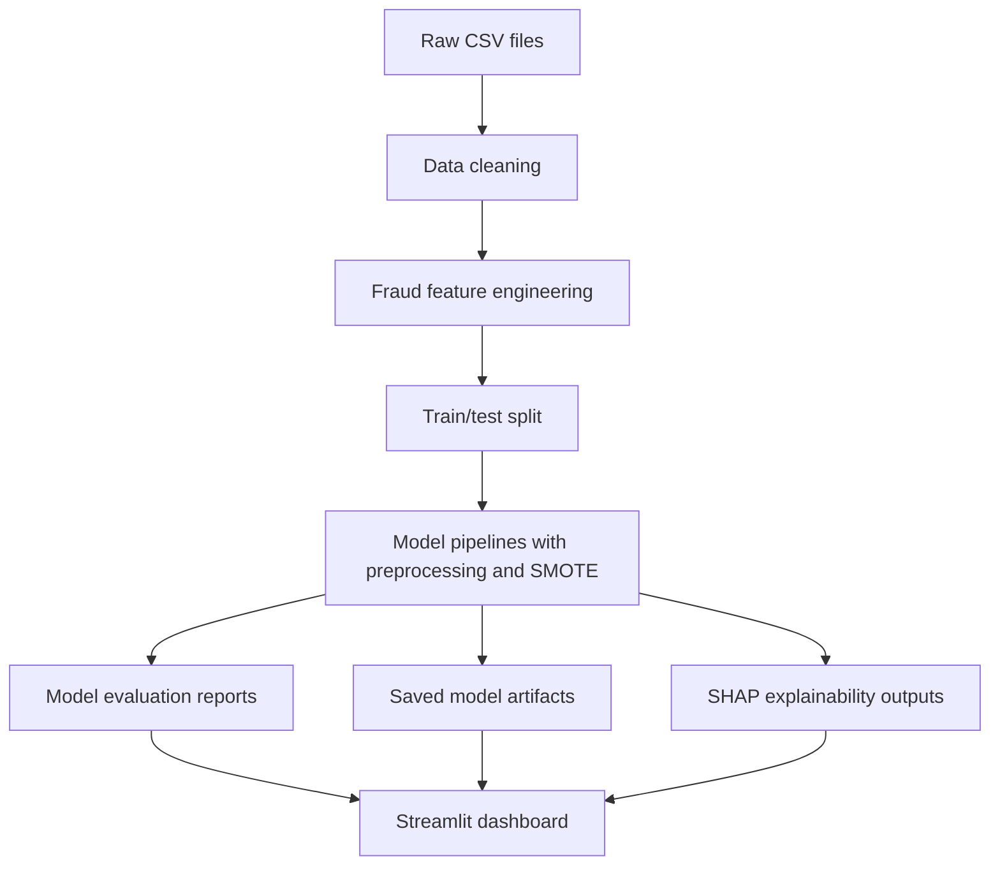

# FraudPulse

FraudPulse is an end-to-end fraud analytics project focused on improving fraud detection for e-commerce and bank transactions. The project now runs as a Python application, trains both required models, produces evaluation artifacts, generates SHAP-based explainability outputs, and includes a Streamlit dashboard for interactive review and batch scoring.

## Challenge Context

The business goal is to help Adey Innovations Inc. detect fraudulent activity more accurately across two different transaction environments:

- E-commerce transactions with user behavior, device information, and geolocation signals.
- Bank credit-card transactions with anonymized PCA features and severe class imbalance.

The project is designed around the core fraud-detection workflow:

- Clean and preprocess the raw data.
- Engineer fraud-oriented features such as time since signup, transaction velocity, and geolocation.
- Handle class imbalance with SMOTE on the training split only.
- Train and compare Logistic Regression and Random Forest models.
- Evaluate models with imbalance-aware metrics such as AUC-PR, F1-score, precision, recall, and confusion matrices.
- Interpret the best model for each dataset using SHAP.

## Architecture

FraudPulse is structured as a reproducible Python analytics system. The design separates data preparation, modeling, artifact generation, and presentation so the same project can support exploration, evaluation, and demonstration.

### System Flow



### Architecture Breakdown

- `Data layer`: local CSV datasets for e-commerce fraud, IP-to-country mapping, and credit-card fraud transactions.
- `Processing layer`: cleaning utilities normalize types, handle duplicates, repair missing values, and prepare each dataset for analysis.
- `Feature layer`: the fraud dataset is enriched with geolocation, behavioral, and time-based features to capture suspicious transaction patterns.
- `Model layer`: Logistic Regression and Random Forest are trained and compared using a reproducible preprocessing-and-balancing workflow.
- `Evaluation layer`: metrics, confusion matrices, ROC curves, PR curves, feature-importance tables, and SHAP outputs are written as reusable artifacts.
- `Application layer`: the Streamlit dashboard reads saved reports and models to provide inspection, comparison, and batch scoring.

### Component View

```text
Raw Data
  -> DataCleaner
  -> FeatureEngineer
  -> Pipeline Orchestrator
  -> Model Trainer and Evaluator
  -> Saved Artifacts
  -> Streamlit Dashboard
```

## Repository Layout

```text
FraudPulse/
|-- .github/workflows/        CI configuration
|-- data/                     Local datasets only, ignored by git
|-- plots/                    Legacy plot outputs from earlier work
|-- src/
|   |-- __init__.py
|   |-- data_cleaning.py
|   |-- eda.py
|   |-- feature_engineering.py
|   |-- modeling.py
|   |-- pipeline.py
|   `-- preprocess_fraud_data.py
|-- streamlit_app.py          Interactive dashboard
|-- requirements.txt
`-- README.md
```

## Datasets

The project expects these files in `data/`:

- `Fraud_Data.csv`
- `IpAddress_to_Country.csv`
- `creditcard.csv`

The current workspace also supports the nested credit-card path `data/creditcard.csv/creditcard.csv` because that structure already exists locally.

Note: raw data is intentionally ignored by git so the repository stays lightweight and can be shared without shipping datasets.

## Feature Engineering Strategy

### E-commerce Fraud Data

The pipeline creates business-relevant signals from the original transaction records:

- `hour_of_day`
- `day_of_week`
- `time_since_signup_hours`
- `time_since_signup_days`
- `transaction_count`
- `user_average_purchase`
- `device_shared_users`
- `seconds_since_previous_purchase`
- `purchase_value_to_user_mean`
- `velocity`
- `country` derived from IP range mapping

These features are intended to capture suspicious timing, repeat behavior, device reuse, and unusual purchase intensity.

### Credit Card Data

The credit-card dataset is already heavily transformed. The pipeline keeps the provided PCA-based features, fills missing values, scales the numeric space, and trains imbalance-aware classifiers without changing the semantic structure of the original data.

## Modeling Approach

Two models are trained on each dataset:

1. Logistic Regression as the interpretable baseline.
2. Random Forest as the stronger ensemble benchmark.

Each model is wrapped in an imbalanced-learning pipeline that includes:

- Missing-value imputation
- Standard scaling for numeric features
- One-hot encoding for categorical fraud features
- SMOTE oversampling on the training split only
- Final classifier training

The best model is selected primarily by AUC-PR, then F1-score, ROC AUC, and precision.

## Explainability

FraudPulse generates SHAP explainability outputs for the best saved model of each dataset when the `shap` package is available. The pipeline writes:

- SHAP summary plot images
- Feature-importance CSV files
- Dataset-level JSON reports that the dashboard can read

If SHAP is not available in the environment, the training pipeline still completes and falls back to model-based feature-importance tables.

## Setup

### 1. Clone the repository

```bash
git clone <your-repository-url>
cd FraudPulse
```

### 2. Create and activate a virtual environment

Windows PowerShell:

```powershell
python -m venv .venv
.venv\Scripts\Activate.ps1
```

macOS or Linux:

```bash
python -m venv .venv
source .venv/bin/activate
```

### 3. Install dependencies

```bash
pip install -r requirements.txt
```

### 4. Add the datasets

Place the required CSV files inside the local `data/` folder:

```text
data/
|-- Fraud_Data.csv
|-- IpAddress_to_Country.csv
`-- creditcard.csv
```

## How To Run The Project

Run the full training pipeline from the repository root:

```bash
python -m src.preprocess_fraud_data --data-dir data --artifact-dir artifacts
```

What this command does:

- Loads and cleans both datasets
- Engineers fraud features
- Splits train and test data
- Trains Logistic Regression and Random Forest models
- Evaluates each model
- Saves plots, JSON reports, and trained model files under `artifacts/`

When the run finishes, the main dashboard manifest will be created at:

```text
artifacts/project_manifest.json
```

## How To Run Streamlit

Start the dashboard after the training pipeline has completed:

```bash
python -m streamlit run streamlit_app.py
```

If `python` maps to a different interpreter on your machine, you can also use:

```bash
py -m streamlit run streamlit_app.py
```

The dashboard allows you to:

- Review the best model for each dataset
- Compare Logistic Regression and Random Forest metrics
- Inspect confusion matrix, ROC, PR, and SHAP outputs
- Upload a CSV file for batch scoring using the saved best model

## Expected Output Structure

After running the training pipeline, you should see a structure similar to this:

```text
artifacts/
|-- project_manifest.json
|-- ecommerce_fraud/
|   |-- models/
|   |-- plots/
|   `-- reports/
`-- credit_card_fraud/
    |-- models/
    |-- plots/
    `-- reports/
```

## Evaluation Philosophy

Fraud detection is not a plain accuracy problem. The project emphasizes metrics that reflect the real business trade-off:

- High precision reduces customer friction from false alarms.
- High recall reduces missed fraud losses.
- AUC-PR is especially important because both datasets are highly imbalanced.
- F1-score helps compare the balance between precision and recall.

This is why FraudPulse selects the winning model using AUC-PR first rather than defaulting to raw accuracy.

## Deliverables Alignment

This repository is structured to provide:

- Reproducible preprocessing and feature engineering code
- Model comparison and justification
- Explainability artifacts for final reporting
- A professional README with setup and run instructions
- A dashboard for visual review and demonstration

## Troubleshooting

If the training script cannot find the credit-card dataset, check whether your file is stored as:

- `data/creditcard.csv`
- `data/creditcard.csv/creditcard.csv`

If the dashboard starts but shows a warning, run the training pipeline first so `artifacts/project_manifest.json` is created.

If SHAP output is missing, verify that the environment installed all packages from `requirements.txt`, then rerun the pipeline.

## References

- Kaggle Credit Card Fraud Detection dataset
- Kaggle Fraud E-commerce dataset
- SHAP documentation
- scikit-learn documentation
- imbalanced-learn documentation

## Project Status

Current scope:

- Task 1: Implemented in Python modules
- Task 2: Implemented in a reproducible training pipeline
- Task 3: Implemented with SHAP-driven explainability outputs

FraudPulse is now structured as a runnable Python project.
